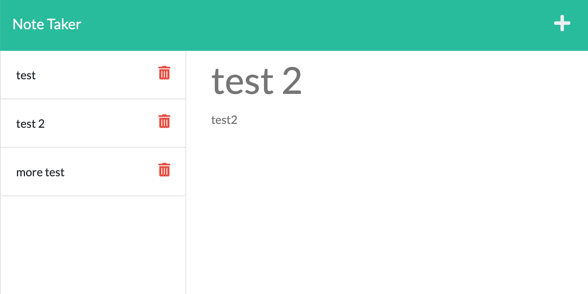

# Simple Note Taker
AS A small business owner
I WANT to be able to write and save notes
SO THAT I can organize my thoughts and keep track of tasks I need to complete

## Table of Contents
* [How it works](#how-it-works)
* [Features](#features)
* [Technoliges Used](#technologies-used)
* [Deployed URL](#deployed-url)

## How it works:
- click **Get Started**
- add note title and note text
- click save button on top
- click + to add another note
- after click save, saved notes list will appear on your left
- click note title from the list to view saved note again

## Features:
- User cannot save a note without a missing note title OR note text
- Each note is saved in a note array with an unique id
- User can view saved notes by selecting a note from the list
### Example:


## Technologies Used:
1. express
```javascript
const express = require('express');

app.use(express.urlencoded({ extended: true }));
app.use(express.json());
app.use(express.static('public'));
```

2. uniqid
```javascript
const uniqid = require('uniqid');

function createNote(body, noteArray) {
    body.id = uniqid();
    noteArray.push(body);
```

## Deployed URL
https://express-simple-note-take.herokuapp.com/
